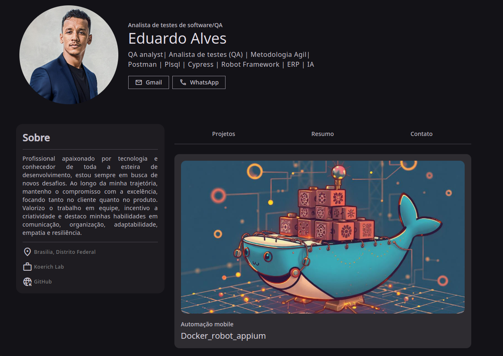

# Meu Portfólio de Projetos

Bem-vindo ao meu portfólio de projetos! Este repositório irá conter uma coleção dos meus principais projetos e servirá como uma apresentação visual das minhas habilidades, experiência e interesses na área de testes de software e tecnologia.

## 🎯 Objetivo

O objetivo deste portfólio é apresentar meus projetos de maneira clara e profissional, facilitando o entendimento das minhas habilidades para potenciais empregadores, colegas de profissão e clientes.

## 📋 Funcionalidades

- **Página inicial**: Resumo das minhas habilidades e links rápidos para os projetos destacados.
- **Projetos**: Cada projeto inclui uma breve descrição, tecnologia utilizada e um link para o repositório ou demonstração ao vivo.
- **Contato**: informações de contato para facilitar a comunicação.

## 🚀 Tecnologias Utilizadas

Este projeto foi desenvolvido com as seguintes tecnologias:

- **Frontend**:
  - HTML5 e CSS3
  - JavaScript
- **Outros**:
  - Git e GitHub para versionamento e hospedagem

## 📂 Estrutura de Pastas
/meu-portfólio
├── public
│   ├── index.html          # HTML principal
│   └── assets              # Arquivos estáticos (imagens, fontes, etc.)
├── src
│   ├── components          # Componentes de React (se aplicável)
│   ├── styles              # Estilos (CSS, SCSS ou módulos de estilo)
│   ├── App.js              # Componente raiz
│   └── index.js            # Ponto de entrada do React
├── README.md
└── package.json            # Dependências e scripts do npm