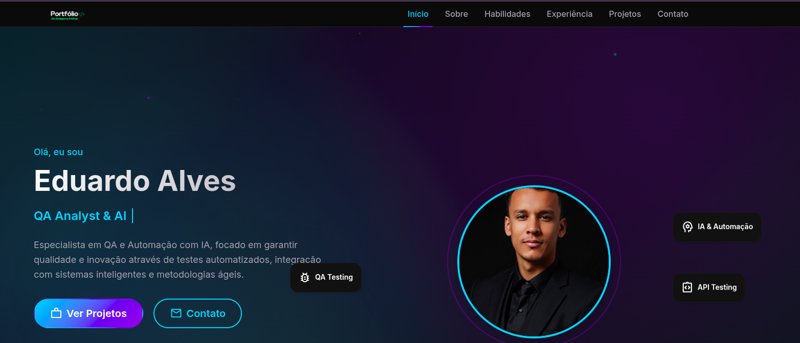

# Portfólio de Eduardo Alves

Bem-vindo ao meu portfólio! Este repositório apresenta uma coleção dos meus principais projetos, destacando minhas habilidades, experiência e paixão por tecnologia.

## 🎯 Objetivo

Este portfólio tem como objetivo demonstrar minha expertise em QA, automação e desenvolvimento, além de servir como uma vitrine profissional para empregadores, colegas e clientes.

## 📋 Funcionalidades

- **Página Inicial**: Resumo das minhas habilidades e links rápidos para os projetos destacados.
- **Projetos**: Descrição detalhada de cada projeto, tecnologias utilizadas e links para repositórios ou demonstrações.
- **Contato**: Informações para facilitar a comunicação.

## 🚀 Tecnologias Utilizadas

### Frontend
- HTML5 e CSS3
- JavaScript
- Bootstrap

### Outros
- Git e GitHub para versionamento e hospedagem

## 📈 Próximos Passos

- Melhorias no design e interatividade
- Atualizar o portfólio com novos projetos e funcionalidades

## 🤝 Contribuições

Contribuições são sempre bem-vindas! Para colaborar:

1. Faça um fork do projeto.
2. Crie uma nova branch: `git checkout -b feature/nova-feature`.
3. Commit suas alterações: `git commit -m 'Adiciona nova funcionalidade'`.
4. Envie para o repositório: `git push origin feature/nova-feature`.
5. Abra um Pull Request.

## 📞 Contato

Entre em contato comigo através das seguintes plataformas:

- **Email**: [eduardo.telecomrbs@gmail.com](mailto:eduardo.telecomrbs@gmail.com)
- **LinkedIn**: [linkedin.com/in/eduardo-alves95](https://linkedin.com/in/eduardo-alves95)
- **GitHub**: [github.com/edugitQA](https://github.com/edugitQA)

---

Obrigado por visitar meu portfólio! Espero que você encontre algo inspirador aqui.
